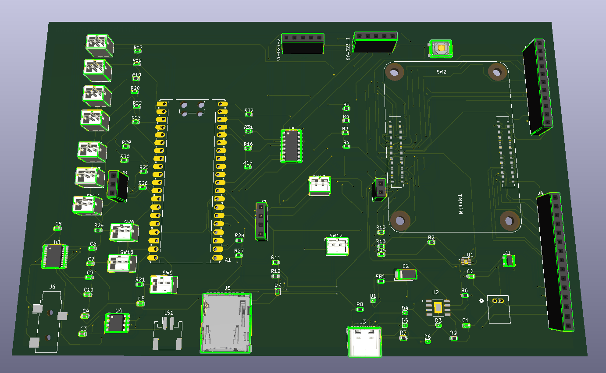
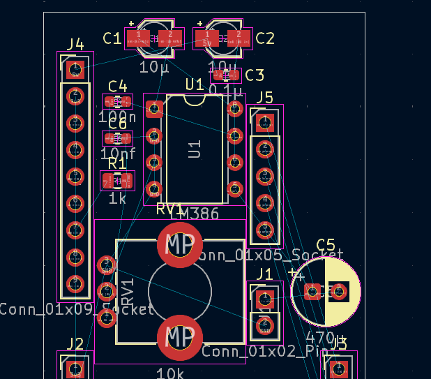
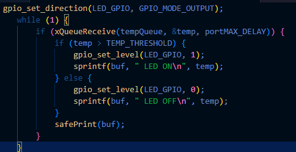
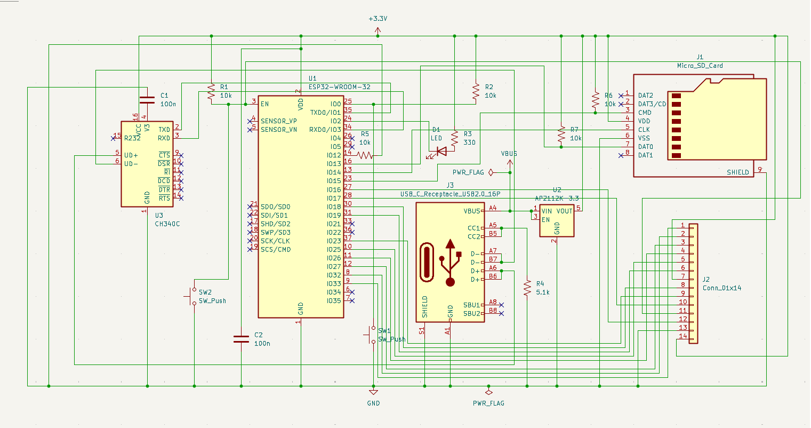
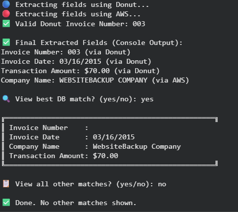

# Hi, I'm Nirrbhay Raghavan  

I’m a Computer Engineering student at **Purdue University (Class of 2027)** passionate about **end-to-end system design**, from PCB layout and embedded firmware to FPGA and AI-driven software.  
My work bridges **hardware, firmware, and computation**, with a focus on building high-performance, real-time systems.

#### <b>Link to all assets here with previews below</b> 

## Featured Projects

### **Current**

#### <b>Portable Handheld Gaming Console</b>

  

Initiated this project by designing a **custom two-layer Raspberry Pi Compute Module 4 (CM4) carrier board**, integrating dual displays, I²S audio DAC, and USB-C PD circuitry.  
Started development with **Jetson Nano prototypes** for architecture testing and schematic validation before migrating to the CM4 platform, optimizing connector layout, signal routing, and thermal performance.  
Currently developing **C/C++ firmware** for display, input, and audio control, focusing on stable Linux bring-up and sub-10 ms I/O response.  
Validated EMI and timing integrity using oscilloscopes and logic analyzers to ensure system-level reliability.  
Planned next phase includes **porting the design to a CM5-based carrier board (Adaxa)** and building **embedded AI utilities** in C++ and Python for intelligent diagnostics, performance monitoring, and adaptive firmware optimization.  

---

#### <b>Microcontroller Weather Station</b>  

  

Designed and completed a **custom sensor-hat PCB** for an ARM Proton board to handle PWM output, radio receiver input, and potentiometer control.  
Currently wiring additional sensors for temperature, humidity, and pressure on a **breadboard circuit**, with ongoing **C/C++ firmware development** for sensor acquisition, data logging, and SD card integration.  
Combining a finished PCB with flexible breadboard testing allows for rapid firmware iteration and peripheral debugging.  
This project highlights practical circuit design, embedded programming, and real-time data acquisition at the microcontroller level.  

---

#### <b>Real-Time Sensor Node (Embedded + FPGA Co-Design)</b>

  

Currently developing a **real-time sensor node platform** that integrates embedded and digital hardware design to achieve sub-10 ms system latency.  
Implementing **ESP32 firmware in C/C++** for concurrent sensor acquisition, communication, and control, while designing a **Verilog-based UART and sensor interface module** for deterministic data timing.  
Actively co-simulating embedded firmware and HDL logic to synchronize hardware–software interaction and validate timing accuracy.  
Using oscilloscopes and simulation tools to benchmark latency, signal stability, and overall system responsiveness.  
This ongoing project aims to bridge **MCU-level control and FPGA signal coordination**, creating a unified, low-latency architecture for next-generation embedded systems.  

---

### **Past**

#### <b>ESP32 HTTP Photo Server</b>

  

  

Designed and built a **custom ESP32-based HTTP photo server** with USB-C power regulation, MicroSD storage, and a SPI TFT display header using KiCad.  
Developed **C++ firmware** for camera image capture, local storage, and Wi-Fi-based streaming.  
Handled peripheral communication via SPI and UART interfaces, optimizing timing and buffer management for smooth data flow.  
Taught and guided students through full system assembly and firmware programming as part of an instructional project.  
This project highlights hands-on PCB design, embedded firmware integration, and end-to-end IoT system development.  

---

#### <b>Intelligent OCR Pipeline</b>

Engineered a **multimodal OCR system** using Donut, LayoutLMv3, and DocTR to extract structured data from invoices.  
Integrated the workflow into **Flask APIs and AWS Lambda**, linked to a PostgreSQL backend with fuzzy matching logic.  
Optimized inference pipelines for 89% field-level accuracy while maintaining scalability and low-latency performance.  
This project bridges high-level AI model development with embedded deployment, demonstrating software efficiency and real-world integration.  

---
